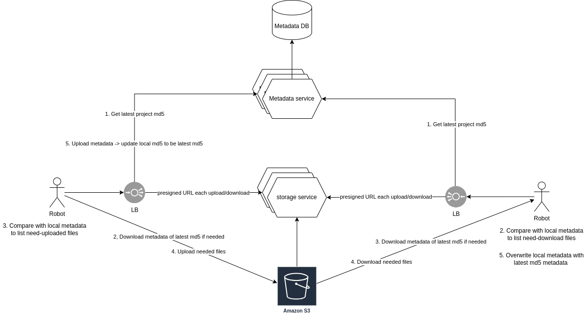
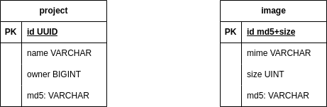
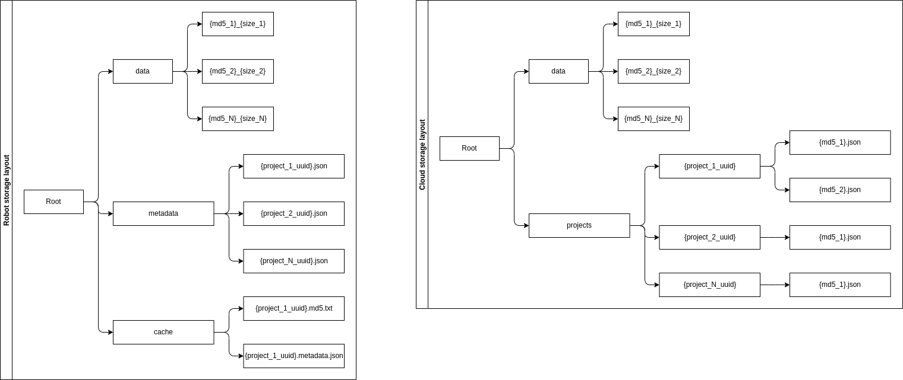

# General

## Functional requirement: 

- Upload:
  - client create a project, capture and store images in robot disk
  - client start upload images of a project from robot to server
  - client can upload images on same project on multiple robot, and be able to resolve conflict if other upload images before

- Download:
  - client can download a project with all images on other robot

## Non-functional requirement:
  - Integrity: all of bytes of an image must be uploaded and stored successfully on server
  - Availability: 
  - Scalability:
  - Rate Limit: should be implement if a client upload too many files at the same time
  - Throughput:

## Assumptions (min, avg, max)
- number of users = 50, 200, 500
- number project of each user = 1, 10, 30
- number of image / project = 10, 500, 10000
- image size = 1 MB, 20 MB, 100 MB
- many duplicate images using accross projects, duplicated percentage is about 20%

## Estimations
- total max project = 500 * 30 = 15000
- total max image = 15000 * 10000 = 150 millions
- max project size = 10000 * 100 = 1 TB
- max storage capacity: no duplicate = 15000 * 1TB = 15 PB
- max storage capacity de-duplication: optimized = 15 * (1 - 0.2) = 12 PB 

# Design

## High-Level Design


## Database Design



## Storage Design



## API
```
- get_project_info(project_id: str) -> info: json
- get_presigned_upload(type: enum, key: str) -> URL: str, s3 metadata: json
- get_presigned_download(type: enum, key: str) -> URL: str, s3 metadata: json
- commit_project_metadata(stream metadata) -> success: bool
```


# Requirements solving approachs

- Integrity:
  - Using AWS [checking object integrity](https://docs.aws.amazon.com/AmazonS3/latest/userguide/checking-object-integrity.html)
- Rate Limit:
  - rate limit on Load Balancer before going into Upload service
- Scalability:
  - on DB `image`, scale by using partition since id are hash
  - scale by container on services, since everything's stateless
- Availability & Storage capacity:
  - using AWS S3
  - Optimize resources on disk/cloud by store image binary by hash (md5_size) -> de-duplicate images with same hash
- Throughput:
  - Get latest md5 and metadata from server to compare with local metadata -> determine only needed-to-upload file
  ```
  Ex: Server has 3 images: A, B, C. Robot 1 already has these 3 images and then add image D, E
  When sync:
    - robot 1 download metadata to determine that only need to upload image D, E
    - But D's already existed on cloud store (from another project)
   -> Only need to upload E
   -> optimize throughput
  ```
- Resolving conflict:
  - Case 1:
    - robot 1 and robot 2 has 3 images: A, B, C in the beginning.
    - Robot 1 add image D and delete image C. Robot 2 add image E
    - Both robot upload images file and then update md5 on DB.
    - Lock by row in DB, suppose that robot 1 update it first. Robot 2 cannot update md5 to DB -> conflict -> resolve conflict on robot 2
    - Robot 2 download latest metadata file and then resolve conflict itself, and then update latest metadata and md5 on DB
  - Case ...:
